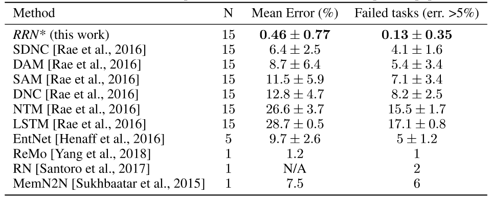
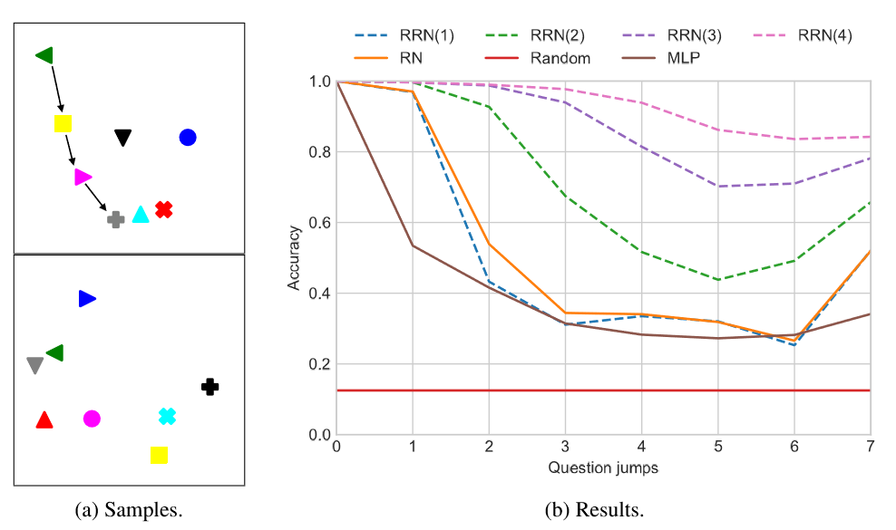

# 个人信息
- 姓名：冯凯
- 学号：21821280
- 主题：Complex Networks
- 邮箱：7fengkai@tongji.edu.cn

# 论文选择

[RecurrentRelationalNetworks](https://arxiv.org/pdf/1711.08028.pdf)
- 作者：Palm, Rasmus Berg，Paquet, Ulrich，Winther, Ole 

* **Abstract**
>This paper is concerned with learning to solve tasks that require a chain of interdependent steps of relational inference, like answering complex questions about the relationships between objects, or solving puzzles where the smaller elements of a solution mutually constrain each other. We introduce the recurrent relational network, a general purpose module that operates on a graph representation of objects. As a generalization of Santoro et al. [2017]’s relational network, it can augment any neural network model with the capacity to do many-step relational reasoning. We achieve state of the art results on the bAbI textual question-answering dataset with the recurrent relational network, consistently solving 20/20 tasks. As bAbI is not particularly challenging from a relational reasoning point of view,we introduce Pretty-CLEVR, a new diagnostic dataset for relational reasoning. In the PrettyCLEVR set-up, we can vary the question to control for the number of relational reasoning steps that are required to obtain the answer. Using Pretty-CLEVR, we probe the limitations of multi-layer perceptrons, relational and recurrent relational networks. Finally, we show how recurrent relational networks can learn to solve Sudoku puzzles from supervised training data,a challenging task requiring upwards of 64 steps of relational reasoning. We achieve state-of-the-art results amongst comparable methods by solving 96.6% of the hardest Sudoku puzzles.

* **摘要**
>本文研究如何解决需要一系列相互依赖的关系推理步骤的任务，例如回答有关对象之间关系的复杂问题，或解决解决方案中较小元素相互约束的难题。我们介绍了循环关系网络，这是一个在对象的图形表示上操作的通用模块。作为Santro等人概括的关系网络，它可以增强任何一种神经网络模型，具有进行多步关系推理的能力。我们使用循环关系网络在BABI文本问答数据集上实现了最新的结果，持续解决20/20任务。由于babi并不是一个特殊的角色，因此它具有与图像相关的功能，因此它引入了一个新的关系推理诊断数据集prettyclevr。在预分类设置中，我们可以改变问题来控制获得答案所需的关系推理步骤的数量。利用prettyclevr，我们探讨了多层感知器、关系网络和循环关系网络的局限性。最后，我们展示了递归关系网络如何从监控的训练数据中学习解数独，以及如何从64个关系推理步骤的所有要求中学习数独。我们通过解决96.6%最难的数独难题，在可比较的方法中获得最先进的结果。 

# 论文解读

### 关系推理

观察下面的图像，不要简单的把这看成是球体，立方体等等。我们可以用数百万个图像像素值的来考虑它或者图像中所有边缘的角度或者考虑每个小像素区域。
现在有一个问题，大球体左边的棕色金属物体留下的圆柱体的大小是多少？这需要考虑对象相对于彼此的相对位置。这种对象和交互中心思维被称为关系推理，它是人类智力的核心部分。例如，现有的卷积网络可以很容易地识别上面图像中的每个对象，但是由于它需要关于彼此的关于对象的推理，所以它没有回答我们刚刚提到的那个问题。

### 关系网络 

Adam Santoro和他的合作者提出了关系网（RN）。这是一个非常简单的模块，可以将关系推理能力添加到任何神经网络中。他们将一个RN添加到标准的卷积网络中，并在CLEVR数据集上训练最终获得了超人类性能。他们还将其用于BaBi——一个文本问题解答任务，而且解决了20个任务中的18个。RN在深度学习领域向前迈出了重要一步，但它也有其局限性。它的构建方式是，每个被识别的对象只能与其他被识别的对象进行一次交互，之后网络必须给出答案。这是RN的限制，因为它不能推导导出的交互，即对象A影响了对象B，反过来影响对象C等等。在RN中，对象A必须直接影响对象C，或者根本不能影响对象C。这看起来这种方法有些笨。

### 循环关系网络 
为了解决这个限制，我们引入了递归关系网络（RRN）。RRN执行多个步骤，而不是仅执行关联推理的单个步骤。在每个步骤中，每个对象都受到其他对象的影响，同时也考虑到它自己以前的状态。这允许交互可以从一个对象传播到另一个对象，从而形成复杂的交互链。

### 实战：大战数独
为了表明RRN可以解决需要非常复杂的关系推理的问题，我们使用它来解决数独（Sudoku）难题。现在，有很多算法来解决Sudokus。RRN在两个重要的方面不同于这些传统的算法：1.这是一个神经网络模块，从数据中学习算法，而不是手工制作。2.它可以被添加到任何其他的神经网络中进行端到端的训练，并给神经网络赋予一个复杂的关系推理能力。对于那些不熟悉Sudoku拼图的人来说，这是一个数字难题，在9x9网格中有81个单元格。每个单元格都是空的，或者从一开始就包含一个数字（1-9）。我们的目标是用一个数字填充每个空单元格，使得每列，每行和3×3不重叠的数字包含1到9的数字。看到下面的两个图像，一个相对简单的数独：30个给定的格子和红色的解决方案。

##### 解决

你不能一步步推断Sudoku的解决方案。它需要很多步骤的方法演绎，中间结果，并可能尝试几个部分的解决方案之前找到正确的。我们训练了一个RRN来解决Sudokus，通过考虑每个单元格的一个对象，这个对象影响到同一行、列和框中的每个其他单元格。我们没有告诉它任何策略，也没有提供任何其他的提示。神经网络学到了一个强大的策略，即使是最困难的数独也只有17个回应，成功率达到96.6％。为了比较，其他的神经网络结构并未能解决这些难题中的任何一个，尽管具有更多参数且被训练更长时间。在每个步骤，RRN为1-9个数字上的每个小区输出一个概率分布，表示网络认为应该在该小区中的哪个数字。

### 实验结果
#### bAbIquestion-answeringtasks

使用10000个培训样本对所有20项任务进行联合培训。标有星号的条目是实验中的数据，其余都来自各自的论文。 

bABI是一个基于文本的数据集，来自Facebook设计为一组推理的先决条件任务。它由20种任务组成，每个任务有10000个问题，包括演绎、归纳、空间和时间推理。每个问题，例如“牛奶在哪里?”前面有许多短句形式的事实，例如“丹尼尔去了花园”，“丹尼尔放下卷发”，在这个“花园”的例子一个编码来自于177个单词的词汇表。如果模型达到95%以上的精度，则认为任务已解决。最困难的任务需要对三个事实进行推理。

#### Pretty-CLEVR

PrettyCLEVR诊断数据集的两个样本。每个样本都有128个相关问题，表现出不同层次的关系推理RRN经过四个步骤的训练，但由于它可以预测每个步骤，因此我们可以评估每个步骤的性能。步骤的数量在括号中说明。 

考虑到bABI不需要进行多个步骤的关系推理，为了验证我们的假设，即我们提出的模型更适合需要更多步骤的关系推理的任务，我们创建了一个“相当聪明”的诊断数据集。这可以看作是所设置的“Pretty-CLEVR”数据集的扩展，它具有非关系和关系性质的问题。“Pretty-CLEVR”更进一步，有非关系问题以及需要不同程度的关系推理的问题。 

### 结论
递归关系网络（RRN）是一个通用模块，它可以用强大的关系推理能力来增强任何神经网络模型性能。我们认为关系推理对许多任务都很重要。例如，玩游戏，Go或Starcraft II，需要识别和推理游戏中的对象，以预测行动的长期结果。另一个例子是自驾车。要安全驾驶，必须识别相关的物体，例如汽车，骑自行车的人，停车标志等，以及他们将如何相互作用的原因。

### 分析
本文提出了一个通用的关系推理模型，用于解决比当前技术水平更复杂的一个数量级的任务。babi和类似的clevr需要几步，pretty-clevr需要八步，数独需要十步以上。本文的关系推理模块可以添加到任何深度学习模型中，以增加强大的关系推理能力。本文得到了最先进的结果数独解决96.6%的最困难的数独与17 givens。还显著提高了babi数据集的先进性，在15次运行中的13次运行中解决20/20个任务，并对所有任务进行了联合培训。每一步都有损失的一个潜在问题是，它可能会鼓励网络学习陷入局部极小的贪婪算法。但是，输出函数r将节点隐藏状态和消息与输出概率分布分开。因此，网络有能力使用隐藏状态的一小部分来保留当前的最佳猜测，该猜测可以在几个步骤中保持不变，而隐藏状态的其他部分用于运行非贪婪的多步骤算法。并行发送所有节点的消息并汇总所有传入的消息可能看起来像是一种非物理性的方法，可能会导致非本地行为和淹没重要消息。但是，由于接收节点隐藏状态是消息函数的输入，因此接收节点在某种意义上可以确定希望接收哪些消息。因此，SUM可以看作是对传入消息的一种隐式注意机制。同样，网络可以根据接收和发送节点的历史和当前状态忽略消息，从而学习最佳消息传递计划。 

# 复现
见src目录

