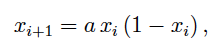
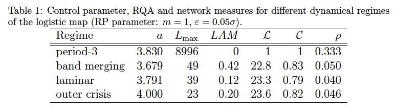
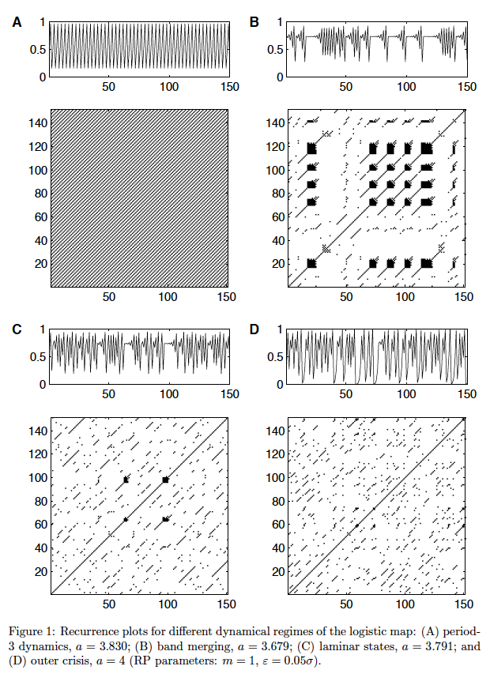
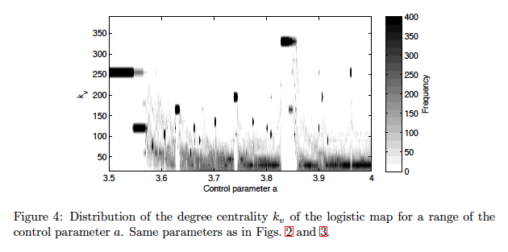

### 个人信息
- 姓名：刘奇煚
- 学号：21821129
- 主题：复杂网络（ComplexNetworks）
- 邮箱：i@6-79.cn

### 计划安排

|Task|Due|Done|
|:--:|:--:|:--:|
|1.选择论文|Mar.14|√|
|2.精读论文|Mar.21|√|
|3.复现论文|Apr.4||
|4.完成实验|Apr.11||
|5.撰写报告|Apr.18|√|

### 选择论文

[Complex network approach for recurrence analysis of time series](https://arxiv.org/pdf/0907.3368.pdf)

* **Abstract**
>We propose a novel approach for analysing time series using complex network theory. We identify the recurrence matrix (calculated from time series) with the adjacency matrix of a complex network and apply measures for the characterisation of complex networks to this recurrence matrix. By using the logistic map, we illustrate the potential of these complex network measures for the detection of dynamical transitions. Finally, we apply the proposed approach to a marine palaeo-climate record and identify the subtle changes to the climate regime.

* **摘要**
>我们提出了一种使用复杂网络理论分析时间序列的新方法。我们利用复杂网络的邻接矩阵识别递归矩阵（根据时间序列计算），并将复杂网络的表征应用于该递归矩阵。通过使用逻辑映射，我们说明了这些复杂网络测量用于检测动态转换的潜力。最后，我们将拟议的方法应用于海洋古气候记录，并确定气候制度的微妙变化。

### 精度论文

#### 中心思想

在许多科学学科中，例如工程学，天体物理学，生命科学和经济学，现代数据分析技术作为理解系统潜在复杂动态的手段正变得越来越流行。估计分形或相关维数，Lyapunov指数和互信息的方法已被广泛使用。然而，大多数这些方法需要长数据系列，尤其是它们的不加审核的应用，特别是对于现实世界的数据，可能经常导致陷阱。
在过去的二十年中，递归图法已经被开发为另一种描述复杂动力学的方法。递归图（RP）是二元对称方阵的图形表示，其对两个状态非常接近的时间（即相空间中的邻近）进行编码。基于这样的递归矩阵，可以提取关于系统动态的大量且不同量的信息并进行统计量化（使用递归量化分析，动态不变量等）。同时，这种技术已成为各学科备受关注的主题，并已成功应用于许多领域：动态转换的检测和同步化，蛋白质的研究结构和心脏和骨骼健康状况，生态系统，经济动力学，化学反应和监测机械行为和损害工程，仅举几例。重要的是要强调基于递归图的技术甚至可用于分析短期和非平稳数据，这在研究现实世界数据时经常是一个关键问题。过去几年在开发基于RP的复杂系统分析方法方面取得了很大进展。
在过去十年中，复杂网络已经变得非常流行，用于分析复杂的，特别是空间扩展的系统。复杂网络的局部和全局属性（统计测量）有助于理解扩展系统中不同组件之间复杂的相互关系和信息流，例如社交，计算机或神经网络，食物网，交通网络，电网，甚至是全球气候系统。复杂网络分析的基础是邻接矩阵，表示网络节点之间的链接。与递推矩阵一样，邻接矩阵也是方形，二进制和对称的（在未加权和未加网络的情况下）。
实际上，递推矩阵和邻接矩阵表现出强烈的类比：递归矩阵表示相空间中的邻居，邻接矩阵表示网络中的链路;两个矩阵都体现了对所有分量（相空间矢量和节点）的成对测试。因此，即使在递归和邻接矩阵的统计分析中，我们也可能继续探索进一步的类比。
RP的定量描述符首先以启发式的方式引入，以便区分RP的不同外观。我们还可以考虑将复杂网络理论的测量应用于RP，以量化RP的结构和相应的相空间轨迹的相应拓扑。在这种（更具启发性）意义上，实际上没有必要将相空间轨迹视为网络。
最近，已经报道了桥接复杂网络理论和复发分析方向的第一步。在这些工作中，相空间轨迹的局部性质已经使用复杂的网络测量进行了研究。建议使用相空间轨迹的周期作为节点，并考虑两个周期相似时的链路。所得到的邻接矩阵实际上可以解释为特殊的递归矩阵。这里的重复准则是两个周期的匹配。Xu等人提出了一种补充方法。他通过主题分类研究了相空间轨迹直接邻域的结构形状。下层网络的邻接矩阵对应于递推矩阵，使用固定数量的邻居的递归标准（而不是更常用的邻域的固定大小）。
通过复杂网络分析研究时间序列的其他方法建议使用线性相关或时间序列振幅的另一个特定条件（“可见性”）。
在此，我们证明了递推矩阵可以被认为是无向，未加权网络的邻接矩阵，允许我们使用复杂的网络方法来研究时间序列。这种关于创建复杂网络的问题比各种建议的方法更自然，更简单。复杂的网络统计信息有助于表征网络的本地和全局属性。我们建议使用这些复杂的网络测量来定量描述递归矩阵。通过应用这些度量，我们从递归图中获得了额外的信息，这些信息可用于表征基础过程的动态。我们在相空间轨迹的动力学背景下对这种方法进行了解释。尽管如此，许多这些措施既没有传统RQA的模拟，也没有广义上的非线性时间序列分析，因此，为动力系统的定量分析开辟了新的视角。我们用原型模型系统和地球科学的实际例子来说明我们的方法。

#### 模型结构

##### 应用于逻辑地图

我们通过分析逻辑图来说明所提方法的潜力

特别是在控制参数a∈[3.5,4]的有趣范围内，步长为a=0.0005。在a的分析范围内，可以找到它们之间的各种动态状态和转换，例如，g。，积累点，周期和混沌状态，波段合并点，周期倍增，内外危机。该系统已用于说明RQA的功能。结果表明，基于对角线的RQA测量能够检测混沌阶跃转移，基于垂直线的测量甚至可以检测混沌-混沌跃迁。

对于转换的研究，建议使用复发阈值ε，保持固定的复发率，比如说5％。但是，在逻辑映射的特殊情况下，这种方法会导致周期性窗口内的问题。在这些窗口中，状态在随后的时间步骤之间快速交替，导致高复发率（大于25％）。因此，不存在保持5％复发率的阈值，因此，我们无法计算周期性窗口内的网络度量。为了避免这种情况，我们将使用固定递归阈值ε作为逻辑映射的示例（对于第4节中的现实世界示例，我们将使用恒定复发率的首选标准）。阈值ε选择为时间序列的标准偏差σ的5％。

对于周期性动力学，波段合并，层流状态（超级跟踪功能的交叉点）和外部危机，我们更详细地研究网络测量（表1）。乐队合并对应于间歇性，内部危机对应于某些混沌-混沌转变，外部危机对应于完全混乱的动态（所有这些转变都是混乱-混乱转变）。

四种不同动力学状态的递归图表现出规则，层流和混沌动力学的不同典型特征（图1）。在周期性方案中，a=3.830，RP仅由不间断的对角线组成（图1A）。它们的距离为3，对应于该周期性制度的周期长度3。在频带合并点，a=3.679，RP显示出扩展的递归点簇，对应于许多层流相（图1B）。此外，出现了几条对角线，显示了状态类似演变的短时期。层状态的RP，a=3.791，也包括（尽管较少）延伸的团簇，但具有更多的对角线（图1C）。对于外部危机，a=4，出现对角线，但比较小的a出现的那些（图1D），这与对于a=4（相对于较小的a）最大的Lyapunov指数一致。

两个RQA测量Lmax和LAM证实了这些视觉观察（表1）。对于期间3方案，我们找到最长的对角线。对角线的最大长度随着控制参数a的增加而减小。正如预期的那样，层流在频带合并点（a=3.679）处获得最高值，LAM=0.42，但在3期制度中最低，LAM=0.在超级轨迹函数的交叉点，层间性略有增加（LAM）=0.12），在外部危机中，间歇性明显增加（LAM=0.20）。

复杂的网络测量也突出了这些动态政权的拓扑结构中的差异（表1）。
在第3期制度（a=3.830）中，观察值在三个不同的状态之间跳跃。这三种状态在相空间中是孤立的，并且不被认为是邻居（在重现定义的意义上）。因此，在复杂网络的意义上，我们有三个断开的组件，其中每个组件包含一个完全连接的网络（因为每个组件中的所有节点在相空间中表示相同的状态）。因此，节点（即状态）之间的平均最短路径长度应为1，并且聚类是完美的。从相应的RP导出的平均路径长度L确实具有最小可能值（L=1），并且聚类系数C取其最大可能值（C=1）。度中心度kv仅取一个值：2999（图2A）。该值大约相当于网络大小的三分之一，因为它的周期为3个周期，由链路密度（ρ=0.333）确定。

对于波段合并（a=3.679），我们发现L=22.8且C=0.83。度分布P（k）具有多模态形状（图2B），这意味着有几个状态像超级节点（即，表现出许多链路）。这些状态位于两个波段的合并点（大约x=0.73）和状态空间的上边界和下边界，即在具有高相空间密度的区域中（图3A）。链路密度ρ=0.050。

对于a=3.791的层状态，我们得到L=23.3和C=0.79。度中心度kv遵循具有轻微双峰性的分布（图2C）。得到的链路密度在四个相应的动力学方案中接近其最低值（ρ=0.040）。

最后，对于外部危机（a=4），我们得到L=23.6和C=0.82。度中心度kv显示与层状态相似的性质，但具有更高的平均值并且得到的链接密度ρ=0.046（图2D）。

从上述结果中，我们得出结论，应用于递归矩阵的复杂网络测量确实对动态变化敏感。平均最短路径长度可以被认为是两个状态之间的相空间距离的上限（以阈值ε为单位）。因此，其平均值L可以被解释为平均距离，其取决于相空间的总直径和碎裂。因此，L随着逻辑映射的相位空间的增长而增加（随着控制参数a的增长）。聚类系数C能够检测聚类相位向量，因为它们出现在周期性或层流动力学中。度中心度kv量化状态v的直接邻域中的相空间密度，而链路密度ρ测量平均相空间密度。此外，从kv分布，我们可以推断，在网络理论意义上，所考虑的递归矩阵不是无标度的。

现在我们计算控制参数a的不同值在范围[3.5,4]内的Lmax，LAM，ρ，L，C和kv。对于a的每个值，我们计算长度N=2,000的时间序列，并通过移除第一个1,000值来排除瞬态。

RQA测量值Lmax通过其值的最大值揭示周期性动态（图3B）。LAM清楚地检测到层状相（图3C）。ρ和C也在周期性动态发作期间显示最大值（图3D和F）。ρ对应于复发率并证实以前的研究。它的值也取决于周期性窗口期间的周期性-周期性越高，ρ越低。因此，倍周期导致该措施的突然减少。在周期性状态中，状态的邻居等于状态本身，导致最大可能的聚类系数C=1，并且导致邻居之间的最短可能路径长度给出L=1.然而，L表示更有趣的行为。在我们对递归矩阵的解释中，L不仅表征了总相空间直径，而且表征了它的碎片。关于逻辑映射，每当相空间中的两个频带合并时（例如，在a=3.5736或a=3.5916），这不仅导致占用的相空间的增加，而且还产生以前不相交的网络的合并。集群。由于平均路径长度的定义不考虑断开的簇中的点对，一旦不同的带之间的距离低于ε，连接节点的平均距离在带合并点之前不久突然增加，因为簇随后变为连接的。这通过L的跳跃清楚地表达（图3E）。kv的分布在周期窗口中是离散的，因此可以清楚地识别（图4）。类似于链路密度ρ，周期窗口中度分布的最大值的位置与周期的数量相关，例如，对于周期-4，我们具有N/4-1=249，对于周期-3N/3-1=332（对于时间序列长度N=1,000）。频带合并点之前的度分布P（k）是宽的并且显示出比频带合并点之后更高的程度，其再次涉及不同网络集群的连接。对于增加的控制参数a，P（k）在小程度上变得更加局部化，从而消除由于越来越混乱的行为（增加Lyapunov指数）导致的复发的减少。

### 复现论文
由于论文并没有提供相应的操作方法，本文无法复现论文或完成实验。

### 撰写报告

[实验报告.md](report.md)
