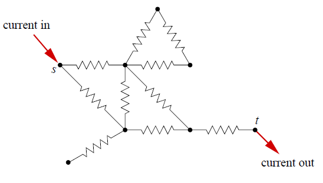
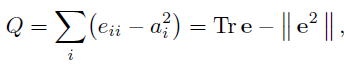
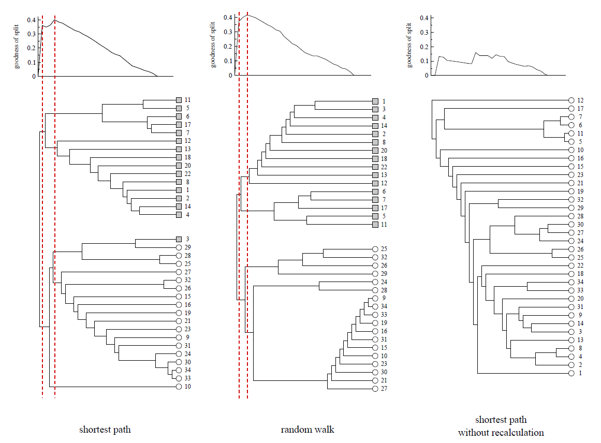

# 个人信息
- 姓名：吴翔
- 学号：21821151
- 主题：复杂网络（Complex Networks）
- 邮箱：21821151@zju.edu.cn

# 论文选择

[Finding and evaluating community structure in networks](https://arxiv.org/pdf/cond-mat/0308217.pdf)

*2004 Physical review*

- 摘要

We propose and study a set of algorithms for discovering community structure in networks—natural divisions of network nodes into densely connected subgroups. Our algorithms all share two definitive features: first, they involve iterative removal of edges from the network to split it into communities, the edges removed being identified using one of a number of possible “betweenness” measures, and second, these measures are, crucially, recalculated after each removal. We also propose a measure for the strength of the community structure found by our algorithms, which gives us an objective metric for choosing the number of communities into which a network should be divided. We demonstrate that our algorithms are highly effective at discovering community structure in both computer-generated and real-world network data, and show how they can be used to shed light on the sometimes dauntingly complex structure of networked systems.

- 正文

本文解决的问题是社区发现(community detection)，模型是传统的图网络模型，图中的节点代表实体，边代表实体之间的联系。

本文介绍的是一种采用层次聚类进行社交网络分析的技术。社区发现主要分为两种基本思想：

1.agglomerative methods，凝聚算法，这类方法从一个个孤立的节点开始，计算每两个节点的相似度，相似度高则这两个节点在同一个社团。这种方法的问题在于：社区中的核心节点往往具有很高的相似度，但是边缘节点则容易被忽略。

2.divisive methods，分裂算法，我们从感兴趣的网络开始，并尝试找到最不相似的连接顶点对，然后去除它们之间的边。通过反复这样做，我们将网络划分为越来越小的组件。我们可以在任何阶段停止该过程，并将该阶段的结果作为网络社区。整个过程可以表示为树形图，描绘了网络连续分裂成越来越小的组。

本文基于分裂思想，算法步骤如下：

   （1）计算网络中所有边的betweenness 
   
   （2）移除betweenness最大的边
   
   （3）重新计算所有边的betweenness
   
   （4）重复步骤2-3直到没有边剩余

"betweenness"解释为连接社团之间（而不是社团内部）节点的度量。betweennes的计算方法：

1. shortest-path betweenness  (最短路经过次数最多的边）

2. random-walk betweenness

3. current-flow betweenness (电阻电流模型)

图划分质量的衡量：模块度（modularity）

($e_ij$ 代表社区i和社区j相连的边数占所有边的比例)

- Examples

社交网络分析的经典研究：Wayne Zachary观察了美国大学空手道俱乐部成员之间的社交互动。他根据俱乐部内部和远离俱乐部的社交互动建立了俱乐部成员之间的联系网络。 偶然的机会，在俱乐部管理员和主要空手道教师之间就是否提高俱乐部费用进行研究期间出现了争议，因此俱乐部最终分成两部分，形成了两个较小的俱乐部，围绕着管理员和老师。

《悲惨世界》人物网络

