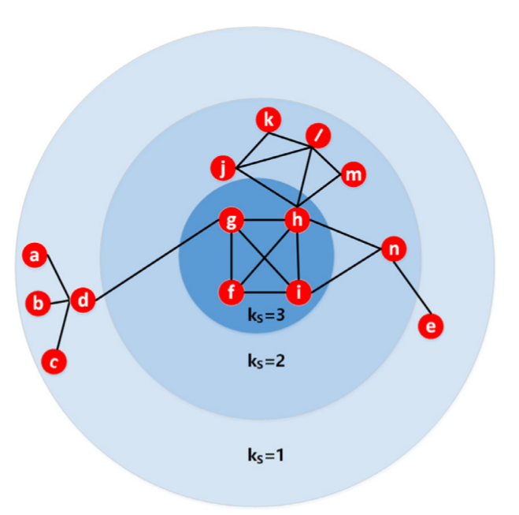
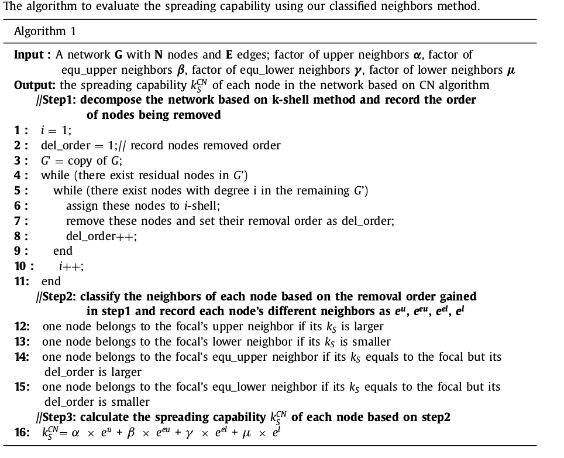
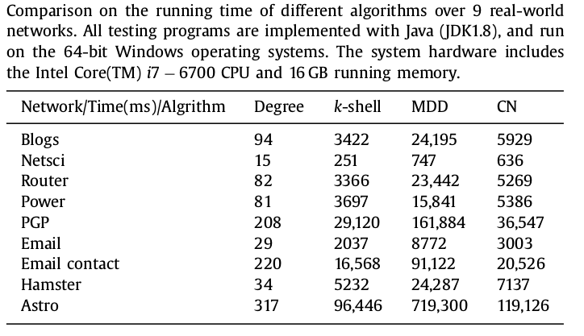

## 个人信息
- 姓名：喻伟强
- 学号：21821281
- 主题：复杂网络
- 邮箱：17816877475@163.com

## 选择论文
[Identification of influential spreaders based on classified neighbors in real-world complex networks](https://www.sciencedirect.com/science/article/pii/S0096300317306884)

**Abstract**
> Identifying the influential spreaders in complex network is a very important topic, which is conducive to deeply understanding the role of nodes in the information diffusion and epidemic spreading among a population. To this end, in this paper, we propose a novel classified neighbors algorithm to quantify the nodal spreading capability and further to differentiate the influence of various nodes. Here, we believe that the contribution of different neighbors to their focal node is different, and then classify the neighbors of the focal node according to the removal order of the neighbor in the process of k-shell decomposition. By assigning different weights for each class of neighbors and summing up the neighbors’ contributions, the spreading capacity of the focal node can be accurately characterized. Through extensive simulation experiments over 9 real-world networks, the weight distribution of different types of neighbors has been optimized, and the results strongly indicate that the current algorithm has the higher ranking accuracy and differentiation extent when compared to other algorithms, such as degree centrality, k-shell decomposition method and mixed degree decomposition approach. Current results can help to greatly reduce the cost of sales promotion, considerably suppress the rumor dissemination and effectively control the outbreak of epidemics within many real-world systems.

**摘要**
> 识别复杂网络中有影响的传播者是一个非常重要的课题，有助于深入理解节点在人群中信息传播和传播的作用。为此，在本文中，我们提出了一种新的分类邻居算法来量化节点扩散能力，并进一步区分各节点的影响。在这里，我们认为不同邻居对其焦点节点的贡献是不同的，然后根据k-shell分解过程中邻居的删除顺序对焦点节点的邻居进行分类。通过为每类邻居分配不同的权重并总结邻居的贡献，可以准确地表征焦点节点的扩展能力。通过对9个真实网络的广泛仿真实验，优化了不同类型邻居的权重分布，结果有力地表明，与其他算法相比，当前算法具有更高的排序精度和分化程度，如度中心性，k-shell分解方法和混合度分解方法。目前的结果有助于大大降低促销成本，大大抑制谣言传播，有效控制许多现实世界中的流行病爆发。

## 精读论文
&emsp;&emsp;目前，几种经典拓扑指标可用于定量表征个体传播能力，如度，接近度，中介性，聚类系数，卡茨中心性等。尽管直觉认为连接最多的节点（集线器）或具有高中介中心性的节点被认为是网络内部非常有影响力的传播者，但许多工作也表明现实世界的传播场景不能很好地与这些观点达成一致。因此，探索新的指数来表示个体的传播能力成为一个有趣的话题。其中，k-shell分解算法利用去皮方法对节点进行排序。在这种方法中，算法首先迭代地删除程度为1的所有节点，直到没有这样的节点为止，并且我们将它们的k-shell值指定为1.以类似的方式，我们将通过递归删除来获得2-shell节点其余节点的度数为2，此过程将继续，直到所有节点都分配一个k-shell值。很明显，具有高k-shell值的节点将倾向于位于网络的中心，因此源自这些节点的覆盖范围可能更大，这意味着更高的扩展能力。基于一些真实的传染病，发现这种方法在识别有影响的传播者方面比其他方法表现更好。

&emsp;&emsp;不同的邻居可能在测量个体传播能力（SC）方面发挥不同的作用。 因此，在本文中，提出了一种精细的方法，根据它们在k-shell分解期间被移除的相对顺序，进一步对邻居进行分类。 然后，将为每类邻居设置不同的权重以表征扩散能力，并进一步模拟几个典型的真实网络数据集上的易感染感染去除（SIR）流行病模型。证明了所提出的算法在度量中心性，k-shell和MDD方法方面优于测量扩散能力的性能。同时，与MDD算法相比，我们的方法的时间复杂度也大大降低。

## 模型和算法

### 分类邻居

&emsp;&emsp;图1所示为一个典型场景，其中节点d的传播能力通常不同于节点a，b和c的扩展能力，尽管它们的k-shell值（kS）是相同的（kS = 1）。这里，节点d在从网络中删除节点a，b和c之后被移除，并且粗粒度k-shell分解不考虑该序列。类似地，在kS = 2层中，节点j和l也与节点k，m和n不同，即使它们的k-shell值都是2。因此，有必要考虑在相同的kS层内节点删除序列并且在网络分解过程中区分对具有相同的kS值的每个节点。我们的方法从上述关于具有相同kS值的节点的分类机制开始，我们将在网络分解过程中同时记录每个节点的k-shell值和删除顺序。如图1所示，对于任何焦点节点，我们将根据它们的kS值将其邻居分类为4个类，并按如下方式将其删除。

- upper邻居：它们的kS值大于焦点节点的k-shell值。例如，节点g是图1中节点d的upper邻居。
- equal upper邻居：它们的kS值等于焦点节点的k-shell值，但它们与焦点节点同时被删除，或者在焦点节点被移除后从网络中删除它们。例如，节点l是节点j，k和m的equal upper邻居。
- equal lower邻居：它们的kS值等于焦点节点的k-shell值，但它们的移除序列较早，例如，节点a，b，c都是节点d的相等的较低邻居。
- lower邻居：它们的kS值小于焦点节点的k-shell值。例如，节点d是节点g的下邻居。

&emsp;&emsp;上述4类的邻居数分别表示为eu，eeu，eel和el。然后，在分类邻居（CN）的基础上，我们如下表征每个节点的传播能力：

$$K_S^{CN}=\alpha \times e^{u} + \beta \times e^{eu} + \gamma \times e^{el} + \mu \times e^{l}$$

其中α，β，γ和μ是介于0和1之间的可调参数。

### 算法

- 模型输入

&emsp;&emsp;模型输入为：一个有Ｎ个节点和Ｅ条边的网络图Ｇ，upper邻居因子$\alpha$，equ_upper邻居因子$\beta$，equ_lower邻居因子$\gamma$，lower邻居因子$\mu$。
- 模型输出
模型输出为网络中每个节点的传播能力$k_S^{CN}$

算法实现在[kshell.cpp](./pictures/kshell.cpp)文件中。

### 时间复杂度比较
&emsp;&emsp;这里我们采用链表作为网络的存储结构。一方面，我们的方法基于经典的k-shell算法，我们需要记录核分解过程中的节点去除序列。但是，节点移除顺序在我们计算k-shell值的时间内完成，因此我们的方法的时间复杂度仍然与k-shell算法O（N + E）相同，尽管时间常数可能更高。另一方面，我们的方法优于MDD方法，MDD方法需要在每次分解时更新其混合度$k_m$。为了深入比较各种方法的性能，我们计算了1000个独立运行在9个网络上的实时消耗，相关结果总结在下表中，并且所有测试都在相同的硬件和软件平台上运行。显然，学位中心性是关于时间消费的最佳中心性，但其他方面具有一定程度的自卑感。然而，我们的方法在分类邻居上的运行时间比经典k-shell的运行时间稍长，但是比MDD的运行时间短得多。综合起来，与k-shell或MDD方法相比，我们获得了更高的性能和适中的时间消耗成本。

## 总结

&emsp;&emsp;在经典的k-shell方法的基础上，我们提出了一种新的复杂网络中有影响的传播者识别算法，并在9个真实网络上进行了大量的数值模拟，并基于节点扩散能力。关于标准的SIR流行病模型。结果表明，与其他方法（如度中心性，k-shell和MDD算法）相比，我们的方法的排序准确性更高，排序差异也更细粒度。此外，时间复杂度也是中间的，因为实际运行时数据显示我们的方法通常位于k-shell和MDD方法之间，这比其他算法（如亲密度和中介中心性）低得多。目前的结果更有利于我们深入理解和分析个体传播能力，甚至有助于制定一些有效的策略来加速某种信息的传播和减缓病态信息的传播，或抑制人口内的疫情爆发。
