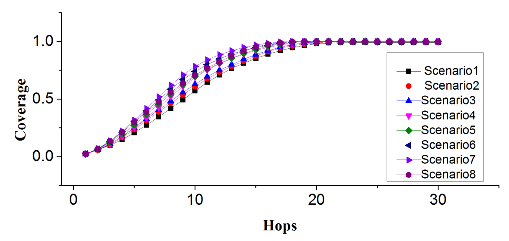
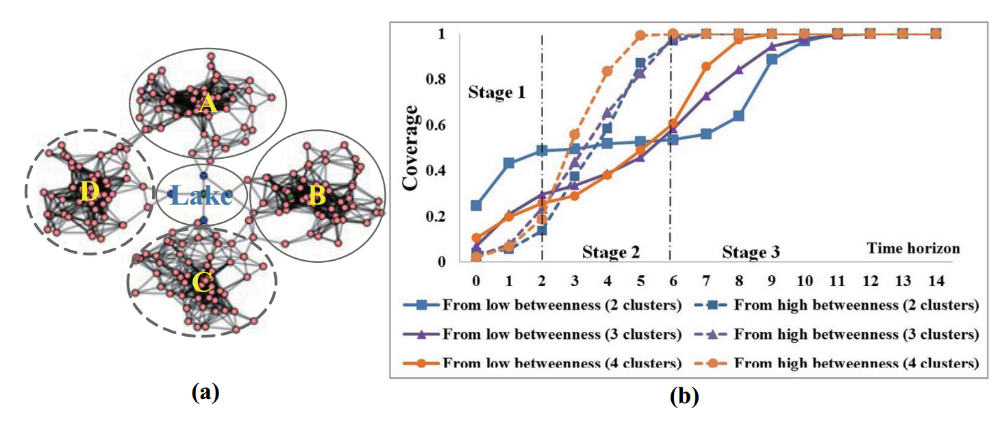
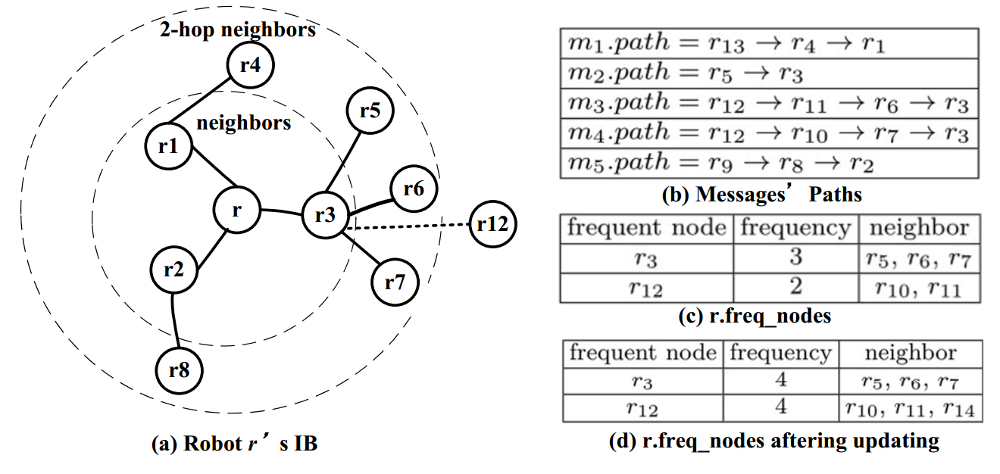
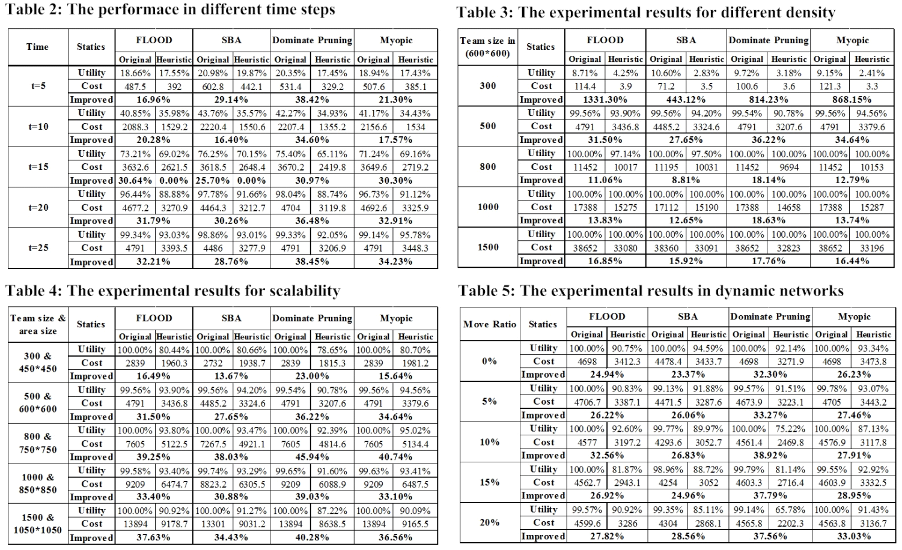

### 个人信息
- 姓名：张苏
- 学号：21821257
- 主题：复杂网络（Complex Networks）
- 邮箱：zhangsu7133@qq.com

### 选择论文

[Using Complex Network Effects for Communication Decisions in Large Multi-robot Teams](https://dl.acm.org/citation.cfm?id=2615731.2615842)

* **Abstract**
> Sharing information is critical to multi-robot team coordination when robots are widely deployed in a dynamic and partially observable environment. To be efficient, robots should balance well between broadcasting information and reserving limited bandwidth so that only the right information should be broadcast to the interested receivers. Robots’ communication decision is normally modeled as a multiagent decision theoretical problem. However, when the team expands to very large, the solution is classified as NEXPCOMPLETE. In this paper, in addition to building heuristic approaches to solve the decision theoretical problem based on the information context to be broadcast, we put forward a novel context-free decision model that allows fast communication decision by considering complex network attributes in large teams. Similar to human society, information should be broadcast if the action can make a good information coverage in the team. We analyze how complex network attributes can improve communication in a broadcast network. By putting forward a heuristic model to estimate those complex network attributes from robots’ local view, we can build decision models either from robots’ experiences or from their local incoming communications. Finally, we incorporate our algorithm in well-known information sharing algorithms and the results manifest the feasibility of our design.

* **摘要**
> 当机器人广泛部署在动态和部分可观察的环境中时，共享信息对于多机器人团队协调至关重要。为了提高效率，机器人应该在广播信息和保留有限带宽之间保持平衡，以保证只有正确的信息才能被广播给感兴趣的接收者。机器人的通信决策通常被建模为多智能体决策理论问题。但是，当团队扩展到非常大时，解决方案被归类为NEXPCOMPLETE。在本文中，除了构建基于需要广播的信息上下文来解决决策理论问题的启发式方法之外，我们还提出了一种新的无上下文决策模型，通过考虑大型团队中的复杂网络属性来实现快速通信决策。与人类社会类似，如果行动可以在团队中实现良好的信息覆盖，则应当广播信息。我们分析了复杂网络属性如何改善广播网络中的通信。通过提出一个启发式模型来估计机器人本地视图中的复杂网络属性，我们可以根据机器人的经验或本地传入的通信建立决策模型。最后，我们将算法结合到众所周知的信息共享算法中，结果证明了我们设计的可行性。

### 精读论文

本文主要针对问题为信息共享，应用场景为大型多机器人团队中的通信决策。论文结合复杂网络的部分性质，为参与通信的机器人个体构建了启发式模型为其评估本地视角下的复杂网络属性，并为通信决策提出了一种构建启发式算法的方法。

论文首先分析了复杂网络属性与信息共享的关联性。下图反映了多机器人所构成的复杂网络中平均距离对于信息共享达到一定覆盖率(Coverage)的总跳(hop)数的影响。简单分析可以发现，需要达到 90% 以上的覆盖率，所需的跳数约为平均距离的两倍。

同时，论文对于复杂网络中度的分布(Degree distribution)同样做了实验研究，其结果如下图所示。可以直观看到，通过高 degree 节点进行信息广播可以凭借较少的跳数获得较高的信息覆盖率，从而证明了高频节点对于提升信息共享效率的价值。

此外，论文还继续探究了集群和中介中间性(Clustering and betweenness centrality)对于信息共享效率的影响。如下图(a)所示，网络中可能由于地理条件影响构成集群，并存在连接多个集群的关键节点。下图(b)中显示了这一集群效应对于信息共享效率的影响，说明了高频中介能够有效提升信息共享效率。

针对于上述探究结果，论文为复杂网络中的机器人节点构建的网络属性模型：<r.avg_dist, r.degree_distribution, r.freq_nodes>，分别代表网络的平均距离、度的分布以及高频节点。由于单个节点无法获取整个网络的属性信息，其模型构建以及更新均为局部的，依赖于先前已收到的消息。因此，所有已接受的消息被储存在节点的IB(Information base)中，并结合后续接受的消息，计算得到局部网络属性。其模型以及简单的更新如下图所示：

基于已构建的局部网络模型，节点可以对每次收到的消息进行决策从而确定是否对其进行重新广播。其算法流程如下：
 1. 通过网络平均距离计算消息跳数阈值；
 2. 搜索邻居节点中未接受消息的节点，计算其 degree 数从而衡量其权重；
 3. 选择 M 个高频节点，并找到其中已经接受消息的节点，以及连接到这些高频节点的邻居节点中已被覆盖的节点，通过删除这些已覆盖的高频节点，可以计算出邻居节点中连接到潜在未覆盖高频节点的数量；
 4. 结合上述三步的计算结果，并结合预设的权重，可以计算出最终的广播概率，通过抽奖算法得到是否对该消息进行重新广播的决策结果。

使用该启发式算法可以对传统的信息共享算法进行一定的优化，包括：Flood、SBA、Dominate Pruning、Myopic 等。其算法的优化结果如下所示：

