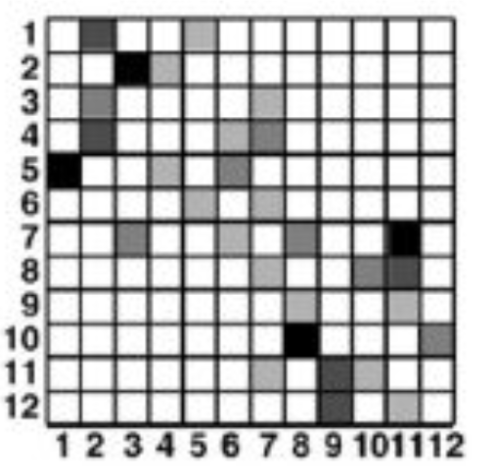
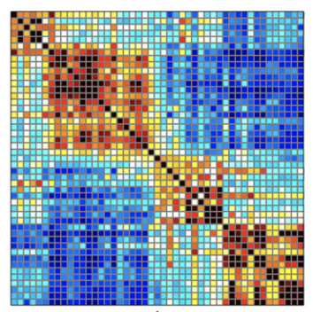
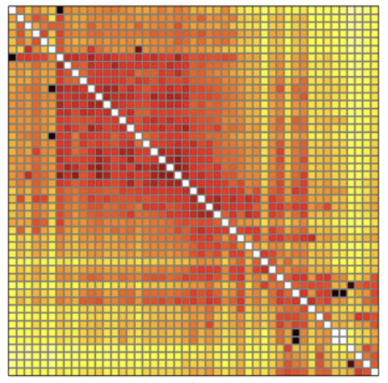

# 个人信息
- 姓名：戴青锋
- 学号：11621022
- 主题：复杂网络（Complex Networks）
- 邮箱：qfdai@zju.edu.cn

# 论文选择

[Complex network measures of brain connectivity: Uses and interpretations](https://sph.umd.edu/sites/default/files/files/Rubinov_Sporns_2009.pdf)

- 摘要

Brain connectivity datasets comprise networks of brain regions connected by anatomical tracts or by
functional associations. Complex network analysis—a new multidisciplinary approach to the study of
complex systems—aims to characterize these brain networks with a small number of neurobiologically
meaningful and easily computable measures. In this article, we discuss construction of brain networks from
connectivity data and describe the most commonly used network measures of structural and functional
connectivity. We describe measures that variously detect functional integration and segregation, quantify
centrality of individual brain regions or pathways, characterize patterns of local anatomical circuitry, and test
resilience of networks to insult. We discuss the issues surrounding comparison of structural and functional
network connectivity, as well as comparison of networks across subjects. Finally, we describe a Matlab
toolbox (http://www.brain-connectivity-toolbox.net) accompanying this article and containing a collection
of complex network measures and large-scale neuroanatomical connectivity datasets.

# 论文解读
论文主要的研究内容为，从脑部结构出发分析其脑复杂网络的构建方式和网络的功能。例如其中很常见的表示方法，
将不同的脑部区域当作是不同的节点，节点的连线即为边，在脑网络结构中这些边可以代表3种含义。
一是解剖学意义上的连接，其含义是物理意义上的连接，即两个节点在脑中是紧挨着的区域；二是
功能性的连接, 其含义是医学上的连接意义，即激活某个节点会使得网络中相连的节点也被激活；
三是有效性连接，其含义是指节点之间的因果关系，即由某个节点指向另一个节点，其之间存在着先后关系，这就
意味着脑网络的图结构是一个有向图。

一般而言，脑复杂网络的表示方法为方阵（行、列的数量一致），其中行和列表示的是节点的数量，而矩阵的元素Mij代表的是节点i和节点j之间的连接强度（或相关性、因果性）。如下图所示,其表示的是一个包含12个节点的脑网络，从图中可以看到的是节点11到节点12之间是有连接的，但是节点12到节点11之间并没有连接，这说明该网络是个有向的网络。

除此之外，还有功能性无向网络，如下图所示，可以看到的是该矩阵是对称的，即不管节点的顺序如何，两者之间的权重
大小是相同的。其中暖色调的颜色表示的是正向的关联性，即前一节点会正向刺激后一节点；冷色调的颜色表示的是反向的
关联性，即前一节点会抑制后一节点。

最后是有效性有向网络，如下图所示。该网络的矩阵表示是个非对称的矩阵，其在(i,j)处的权值的计算方式为将信息从节点i
转移到j的信息熵的变化，因此Mij和Mji对应的权重是不同的。

在构建好网络后需要对此网络进行评估分析，但是直接从上述表示中很难获得直接有效的复杂网络信息，因此文章给出了一些测度（Measures）用于表示
复杂网络的特征，下面是文章中给出的一些复杂网络测度。虽然这些测度是针对于脑网络的，但是仍然可以扩展到其他类型的复杂网络，例如社交网络等。

---
| 测度 | 0-1无向定义 | 权重有向定义 |
--|--|:--:
基本概念和标记|N是网络所有节点的集合，n是节点的数量，(i,j)则是节点i和j之间的连接，aij是i和j之间的连接状态，当(i,j)存在时aij=1，否则aij=0|连接（i,j）之间的权重为wij
度：连接到某个节点的数量||
---

