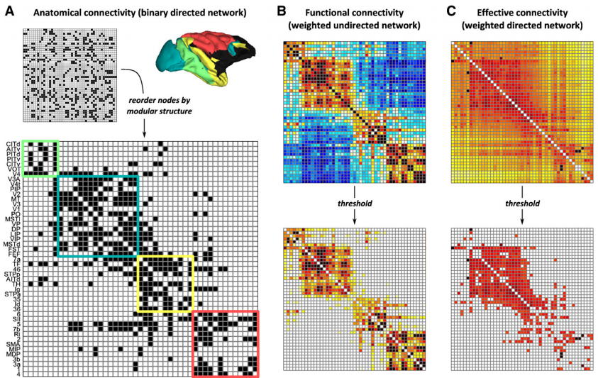
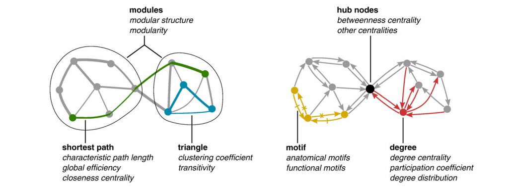

# 个人信息
- 姓名：戴青锋
- 学号：11621022
- 主题：复杂网络（Complex Networks）
- 邮箱：qfdai@zju.edu.cn

# 论文选择

[Complex network measures of brain connectivity: Uses and interpretations](https://sph.umd.edu/sites/default/files/files/Rubinov_Sporns_2009.pdf)

- 摘要

Brain connectivity datasets comprise networks of brain regions connected by anatomical tracts or by
functional associations. Complex network analysis—a new multidisciplinary approach to the study of
complex systems—aims to characterize these brain networks with a small number of neurobiologically
meaningful and easily computable measures. In this article, we discuss construction of brain networks from
connectivity data and describe the most commonly used network measures of structural and functional
connectivity. We describe measures that variously detect functional integration and segregation, quantify
centrality of individual brain regions or pathways, characterize patterns of local anatomical circuitry, and test
resilience of networks to insult. We discuss the issues surrounding comparison of structural and functional
network connectivity, as well as comparison of networks across subjects. Finally, we describe a Matlab
toolbox (http://www.brain-connectivity-toolbox.net) accompanying this article and containing a collection
of complex network measures and large-scale neuroanatomical connectivity datasets.

# 论文解读
大规模脑网络中的节点通常代表大脑的区域，而链接代表解剖，功能或有效连接，具体取决于数据集，例如解剖学连接通常对应于成对脑区域之间的白质束。功能连接对应于时间的大小活动中的相关性可以在解剖学对之间发生不相连的地区。下图显示了说明性的解剖学，功能性和有效性连接网络。

解剖网络代表大规模连接猕猴皮层区域之间的通路，如同整理组织学追踪研究。功能有效的连接网络是根据大脑动力学的时间序列构建的在这个解剖网络上模拟。功能网络表示BOLD信号之间的互相关模式从这些动态估计。有效的网络代表因转移熵计算的因果互动模式，a定向信息流的测量。所有网络都有代表通过它们的连接（邻接）矩阵。行和列这些矩阵表示节点，而矩阵条目表示链接。该连通矩阵中的节点顺序对计算没有影响络措施，但对网络可视化很重要。

集成结构用最短路来衡量，隔离结构用三角形个数衡量，中心结构由上图的红色点的模式来衡量，黄色点代表局部连通性的结构以及黑色点代表中心节点。
