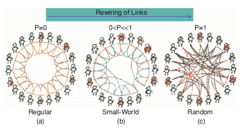
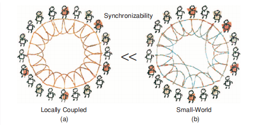
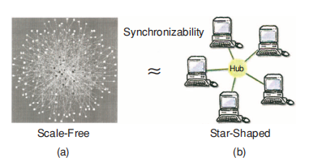

## 个人信息
- 姓名：李安修
- 学号：21821144
- 主题：复杂网络
- 邮箱：l_anxiu@126.com
## 论文选择
论文题目：《Complex networks: small-world, scale-free and beyond》

学术会议/期刊：《IEEE Circuits & Systems Magazine》

### Abstract
In the past few years, the discovery of small-world and scale-free properties of many natural and artificial complex networks has stimulated a great deal of interest in studying the underlying organizing principles of various complex networks, which has led to dramatic advances in this emerging and active field of research. The present article reviews some basic concepts, important progress, and significant results in the current studies of various complex networks, with emphasis on the relationship between the topology and the dynamics of such complex networks. Some fundamental properties and typical complex network models are described; and, as an example, epidemic dynamics are analyzed and discussed in some detail. Finally, the important issue of robustness versus fragility of dynamical synchronization in complex networks is introduced and discussed.

### 摘要
在过去几年中，许多自然和人工复杂网络的小世界和无标度特性的发现激发了人们对研究各种复杂网络的基本组织原则的极大兴趣，这导致了新兴和活跃的研究领域的巨大进步。本文回顾了当前各种复杂网络研究中的一些基本概念，重要进展和重要成果，重点介绍了这种复杂网络的拓扑与动态之间的关系。描述了一些基本属性和典型的复杂网络模型;并且，作为一个例子，对流行病学动态进行了详细的分析和讨论。最后，介绍和讨论了复杂网络中动态同步的鲁棒性与脆弱性的重要问题。

## 论文内容
这篇论文是关于复杂网络(Complex Network)的一篇比较经典的综述类论文，
主要对其网络结构特征进行详细的描述与介绍，首先介绍了三个考察复杂网络的度量概念，
再例举了四种典型的网络模型和其拓扑与同步的问题。

### 三个基本度量概念
- 平均路径长度(Average Path Length)：
两个节点之间的平均距离，即对所有节点对的距离取平均值，
其中两个节点之间的距离定义为连接它们的最短路径的边缘数
- 聚类系数(Clustering Coefficient)：
所有节点的聚类系数的平均值，
每个节点的聚类系数定义为此节点实际存在的边的数量与总可能边数的比率
- 度分布(Degree Distribution)：
节点i的度通常被定义为其连接的总数，
通过分布函数P(k)来表示随机选择的节点具有恰好k个边的概率

### 四种典型网络模型
首先先要了解复杂网络的两个基本特性：小世界和无标度，
小世界特性通俗来讲就是保持较短的特征路径长度并保留较高的聚合系数，
无标度特性意味着节点的连通性分布是一种独立于网络规模的幂律形式，是不均匀的。

1. 常规耦合网络(规则图)：含有n个节点，每个节点有d个邻居节点

1. 随机图：以概率p连接n个节点中的每一对节点

1. WS小世界模型：含有n个节点，每个节点有k个邻居，以概率p随机化重连边

    这可以认为是从规则图到随机图的转化，
    从规则图开始，将其连接随机化，
    将连接的一端移动到从整个网络随机选择的新节点。

    

	同步问题：对于一个规则图，只需添加一小部分远距离链路就可以大大增强其同步，
	并使其成为一个小世界模型。

	 

1. BA无标度模型：在n个节点的基础上，加入新节点并将新节点连接到已有节点

	BA无标度模型提出了增长(Growth)和优先附着(Preferential Attachment)的概念，
    即大多数网络通过添加新节点而不断增长的事实，并且新节点优先附加到具有大量连接的现有节点，
    BA无标度模型算法通过在每个时间步引入一个新节点并将其连接到m个已存在的节点，
    而新节点将连接到节点i的概率取决于节点i的度ki。

    同步问题：无标度模型的同步结构与星形耦合网络类似，
    随机删除网络中的一些节点后，在不改变耦合矩阵的第二大特征值的情况下，
    其同步稳定性将保持不变。
	同时也可以看到，虽然它对随机错误的容忍度较高，
	但由于网络中存在部分度比较大的重要节点，
	因此其也极易受到蓄意攻击，
	这也是其网络结构鲁棒性与脆弱性并存的问题所在。

	 
