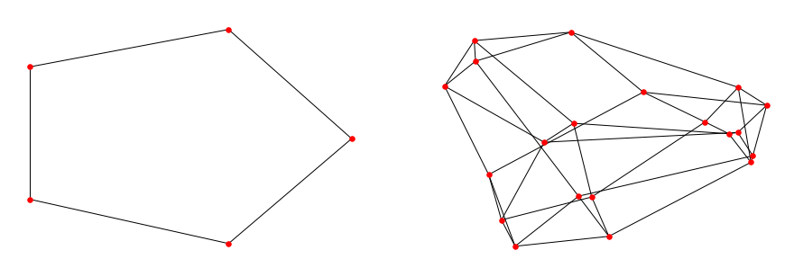
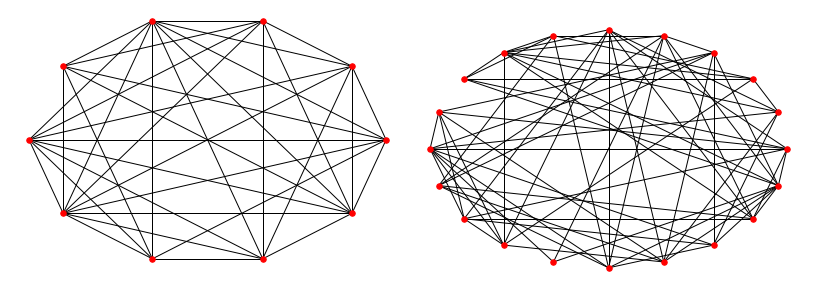
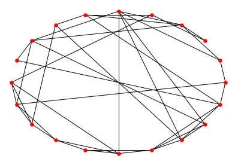
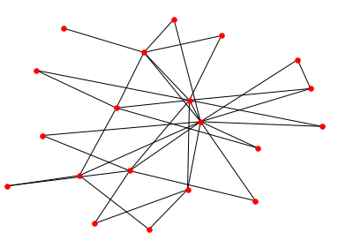

## 个人信息
- 姓名：李安修
- 学号：21821144
- 主题：复杂网络
- 邮箱：l_anxiu@126.com

## 论文选择
论文题目：《Complex networks: small-world, scale-free and beyond》

学术会议/期刊：《IEEE Circuits & Systems Magazine》

### Abstract
In the past few years, the discovery of small-world and scale-free properties of many natural and artificial complex networks has stimulated a great deal of interest in studying the underlying organizing principles of various complex networks, which has led to dramatic advances in this emerging and active field of research. The present article reviews some basic concepts, important progress, and significant results in the current studies of various complex networks, with emphasis on the relationship between the topology and the dynamics of such complex networks. Some fundamental properties and typical complex network models are described; and, as an example, epidemic dynamics are analyzed and discussed in some detail. Finally, the important issue of robustness versus fragility of dynamical synchronization in complex networks is introduced and discussed.

### 摘要
在过去几年中，许多自然和人工复杂网络的小世界和无标度特性的发现激发了人们对研究各种复杂网络的基本组织原则的极大兴趣，这导致了新兴和活跃的研究领域的巨大进步。本文回顾了当前各种复杂网络研究中的一些基本概念，重要进展和重要成果，重点介绍了这种复杂网络的拓扑与动态之间的关系。描述了一些基本属性和典型的复杂网络模型;并且，作为一个例子，对流行病学动态进行了详细的分析和讨论。最后，介绍和讨论了复杂网络中动态同步的鲁棒性与脆弱性的重要问题。

## 论文内容
这篇论文是关于复杂网络(Complex Network)的一篇比较经典的综述类论文，
主要对其网络结构特征进行详细的描述与介绍，首先介绍了三个考察复杂网络的度量概念，
再例举了四种典型的网络模型和其拓扑与同步的问题。

### 三个基本度量概念
- 平均路径长度(Average Path Length)：
两个节点之间的平均距离，即对所有节点对的距离取平均值，
其中两个节点之间的距离定义为连接它们的最短路径的边缘数
- 聚类系数(Clustering Coefficient)：
所有节点的聚类系数的平均值，
每个节点的聚类系数定义为此节点实际存在的边的数量与总可能边数的比率
- 度分布(Degree Distribution)：
节点i的度通常被定义为其连接的总数，
通过分布函数P(k)来表示随机选择的节点具有恰好k个边的概率

### 四种典型网络模型
首先先要了解复杂网络的两个基本特性：小世界和无标度，
小世界特性通俗来讲就是保持较短的特征路径长度并保留较高的聚合系数，
无标度特性意味着节点的连通性分布是一种独立于网络规模的幂律形式，是不均匀的。

1. 常规耦合网络(规则图)：含有n个节点，每个节点有d个邻居节点

1. 随机图：以概率p连接n个节点中的每一对节点

1. WS小世界模型：含有n个节点，每个节点有k个邻居，以概率p随机化重连边

    这可以认为是从规则图到随机图的转化，
    从规则图开始，将其连接随机化，
    将连接的一端移动到从整个网络随机选择的新节点。

    

	同步问题：对于一个规则图，只需添加一小部分远距离链路就可以大大增强其同步，
	并使其成为一个小世界模型。

	 

1. BA无标度模型：在n个节点的基础上，加入新节点并将新节点连接到已有节点

	BA无标度模型提出了增长(Growth)和优先附着(Preferential Attachment)的概念，
    即大多数网络通过添加新节点而不断增长的事实，并且新节点优先附加到具有大量连接的现有节点，
    BA无标度模型算法通过在每个时间步引入一个新节点并将其连接到m个已存在的节点，
    而新节点将连接到节点i的概率取决于节点i的度ki。

    同步问题：无标度模型的同步结构与星形耦合网络类似，
    随机删除网络中的一些节点后，在不改变耦合矩阵的第二大特征值的情况下，
    其同步稳定性将保持不变。
	同时也可以看到，虽然它对随机错误的容忍度较高，
	但由于网络中存在部分度比较大的重要节点，
	因此其也极易受到蓄意攻击，
	这也是其网络结构鲁棒性与脆弱性并存的问题所在。

	 

## 论文模型
由于本篇论文是一篇以综述为主的文章，主要介绍了各种概念和模型，
并没有在文中提出某种具体的算法或者可实现的模型，
为了有助于对复杂网络基本概念的理解，
针对文中提出的四种基本模型：
规则图，ER随机图，WS小世界网络和BA无标度网络
进行简单的建模实现。

具体模型通过Python实现，用到了networkx包，
这是一个用Python语言开发的图论与复杂网络建模工具，
内置了常用的图与复杂网络分析算法，可以方便的进行复杂网络数据分析、仿真建模等工作。

### 规则图
方法random_graphs.random_regular_graph(d, n)
可以生成一个含有n个节点，每个节点有d个邻居节点的规则图。
下图为实现结果，
左图为包含5个节点、每个节点有2个邻居的规则图，
右图为包含20个节点、每个节点有4个邻居的规则图。



### 随机图
方法random_graphs.erdos_renyi_graph(n, p)
可以生成一个含有n个节点、以概率p连接的ER随机图。
下图为实现结果，
左图为包含10个节点、以0.8的概率连接的随机图，
右图为包含20个节点、以0.4的概率连接的随机图。



### WS小世界网络
方法random_graphs.watts_strogatz_graph(n, k, p)
可以生成一个含有n个节点、每个节点有k个邻居、以概率p随机化重连边的WS小世界网络。
下图为实现结果，
为一个包含20个节点、每个节点有4个邻居、以概率0.4随机化重连的图。



### BA无标度网络
方法random_graphs.barabasi_albert_graph(n, m)
可以生成一个含有n个节点、每次加入m条边的BA无标度网络。
下图为实现结果，
为一个包含20个节点、每次加入2条边的图。



## 论文理解
这篇论文是2003年发表的，当时复杂网络作为一个比较新兴的研究方向，
人们开始尝试应用这种新的理论工具来研究现实世界中的各种大型复杂系统，
其中复杂网络的体系结构以及不同节点之间的关联与同步也引起了大量的探索。
复杂网络发展至今已经有了很多新的开拓，
其小世界、无标度的特性在各个领域都得以应用，
例如将其与生物体的新陈代谢系统、大脑神经网络相结合，
或将其与生物传染病相结合、在流行病传播与免疫控制方面进行研究，
还有交通、通信、计算机甚至传播学方面的应用。

复杂网络被定义为具有
自组织、自相似、吸引子、小世界、无标度中部分或全部性质的网络，
本文中也对小世界和无标度进行了解释。
针对本文所提出的4个基本复杂网络模型，
虽然现实应用中的复杂网络不会这么简单，
是更庞大的拓扑结构，其性质也是更为复杂的，
但是对这些基本网络的理解也能为真正理解复杂网络打下良好的基础。

小世界特性又被称之为是六度空间理论或者是六度分割理论，
它的一种通俗类比即六人定理，
即社交网络中的任何一个成员和任何一个陌生人之间所间隔的人不会超过六个。
小世界网络的特征路径长度较小而聚合系数较大，
通过添加一小部分远距离链路就可以大大增强其同步性，
这些特点与网络中的信息传播有着密切的联系。
实际的社会、生态等网络都是小世界网络，
在这样的系统里，信息传递速度快，
并且少量改变几个连接，就可以剧烈地改变网络的性能，
如蜂窝电话网，只需改动很少几条线路，就可以显著提高性能。

无标度特性更符合现实中的网络，
其中大部分都不是随机网络，少数的节点往往拥有大量的连接，而大部分节点却很少。
这反映了复杂网络具有严重的异质性，其各节点之间的连接状况（度数）具有严重的不均匀分布性，
度数较大的关键节点对无标度网络的运行起着主导的作用。
从广义上说，无标度网络的无标度性是描述大量复杂系统整体上严重不均匀分布的一种内在性质。
其中无标度网络鲁棒但又脆弱的特性也很有意思，
其对随机故障策略，即随机移除一些点，有很高的鲁棒性；
但对蓄意攻击策略，即移除网络中部分度最高的节点，表现得非常脆弱。
考虑在现实的互联网中，
如果黑客蓄意攻击一些关键网络节点，
对整个网络的打击将是巨大的。

同时，复杂网络也存在一定的集群特性，
例如社会网络中总是存在熟人圈或朋友圈，其中每个成员都认识其他成员。
集群程度的意义是网络集团化的程度；这是一种网络的内聚倾向。
一个大网络中各集聚的小网络分布和相互联系的状况可以通过连通集团的概念来反映。
